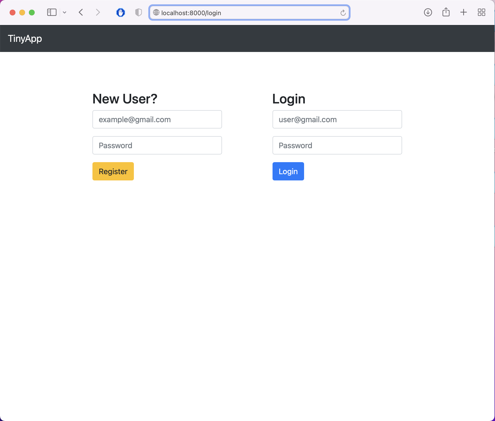
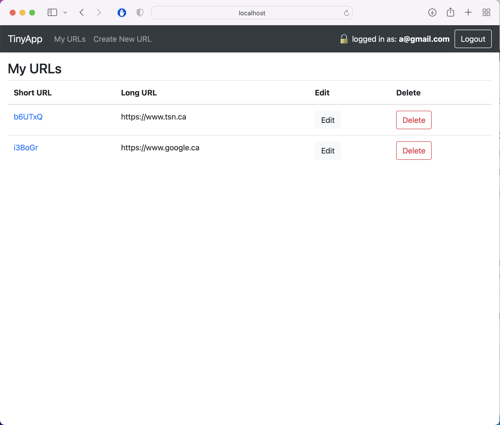
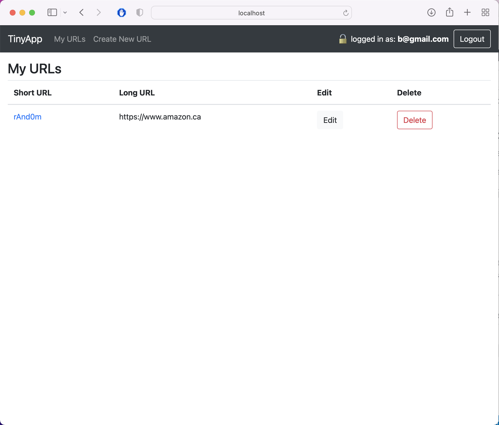
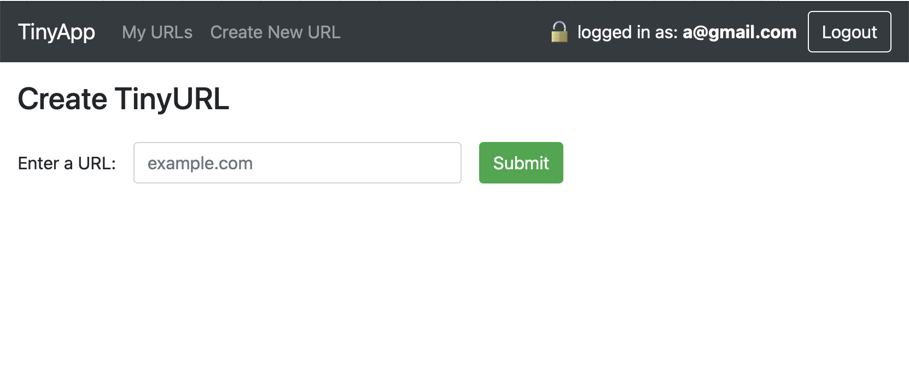
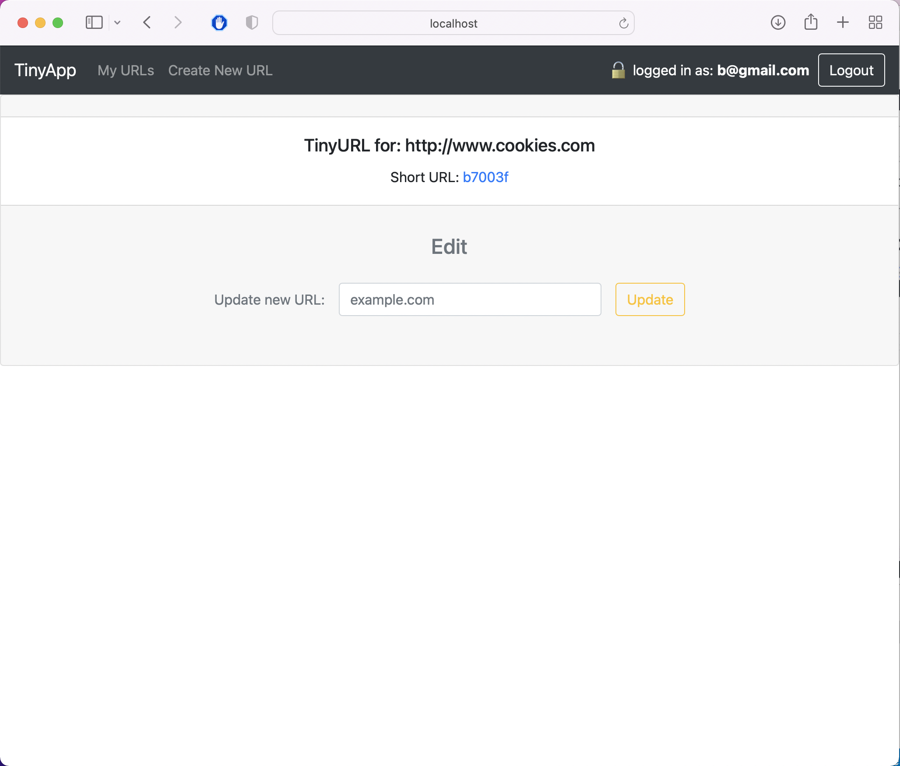

# Turn Bit.ly

Project duration: 4 days

A RESTful application using  Express framework and Node to let users shorten long URLs into bit.ly form.

### Needed Improvement
* `create new url` form handling valid inputs that
  * start with:
    - [x] https://
    - [x] https://www.
    - [ ] https://example.com
    - [x] www.
  - [ ] have valid url ending

### Final Product

### Dependencies

- Node.js
- Express
- EJS
- bcrypt
- body-parser
- cookie-session

### Getting Started

- Install all dependencies (using the `npm install` command).
- Run the development web server using the `npm start` command.
- Login with:
  - Account 1: a@gmail.com - pwd: a
  - Account 2: b@gmail.com - pwd: b
- Or register new account.