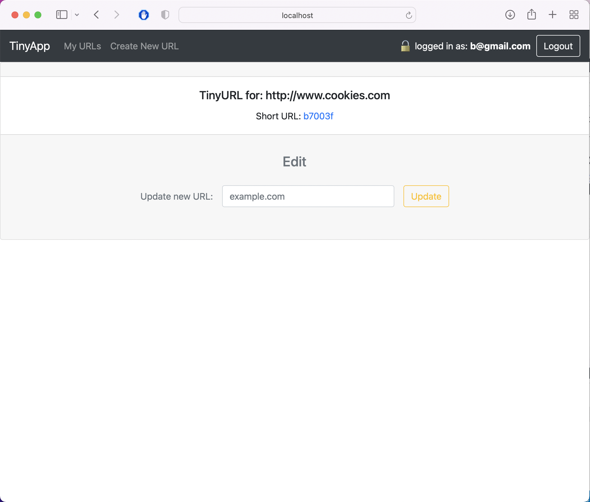

## Turn Bit.ly

A full stack web application built with Node and Express that allows users to shorten long URLs into bit.ly form.

## Final Product

## Dependencies

- Node.js
- Express
- EJS
- bcrypt
- body-parser
- cookie-session

## Getting Started

- Install all dependencies (using the `npm install` command).
- Run the development web server using the `npm start` command.
- Login with:
  - Account 1: a@gmail.com - pwd: a
  - Account 2: b@gmail.com - pwd: b
- Or register new account.